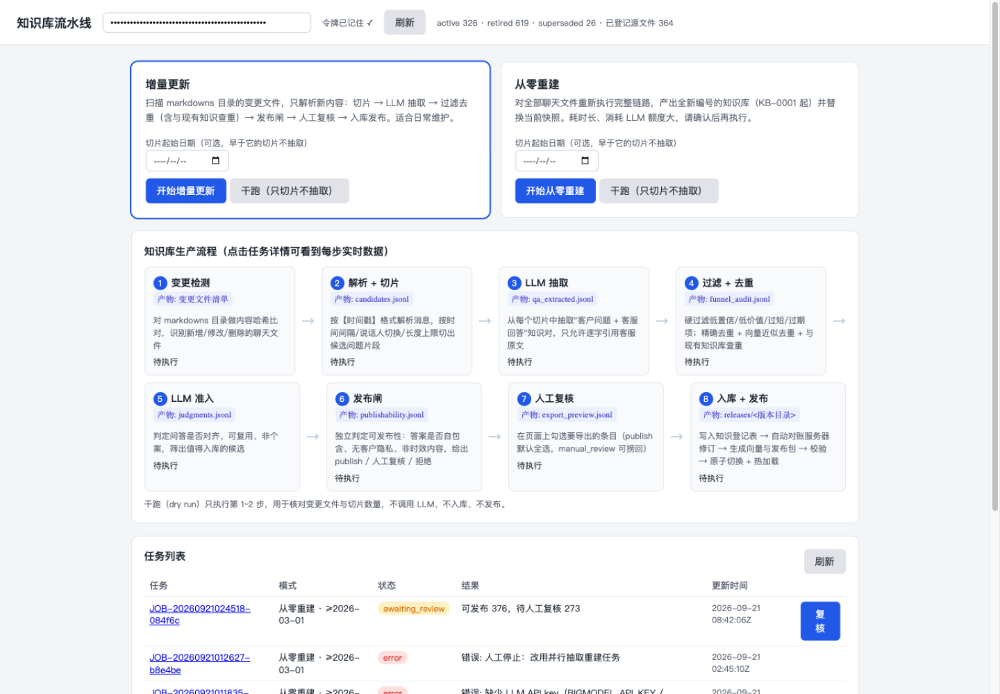
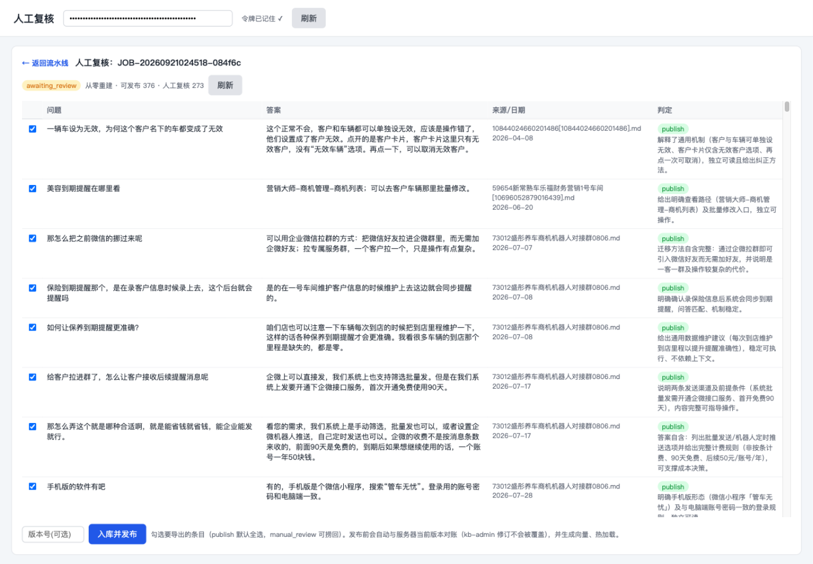

# Agent Knowledge Cleaner

面向 CRM 聊天导出记录的**离线、增量知识生产管线**。聊天记录里噪音太多——寒暄、闲聊、离题、个案、时效内容、客户隐私——**直接把原文向量化去检索,效果很差**。所以本管线不抄近路:先把原始群聊清洗成「可发布、可审计」的结构化问答知识,再对清洗后的知识做向量化发布,任何一条入库回答都可以追溯回聊天原文。

> English version: [README.en.md](README.en.md)

## 界面预览

流水线已迁移至 yj-kb 服务端,通过 Web 界面操作(「知识库·从零重建」「知识库·增量更新」两个主入口):



知识入库前的最后一道闸是人工复核:逐条勾选要导出的条目(publish 默认全选,manual_review 可捞回),填版本号后入库发布:



## 为什么必须先清洗,不能直接向量化

聊天记录是原始对话流,不是知识库。里面大量内容是噪音:

- **寒暄与闲聊**:「好的」「谢谢」「在吗」,以及和业务无关的日常聊天;
- **离题内容**:聊的不是当前系统的话题,答案对本系统用户毫无价值;
- **个案噪音**:操作失误、环境异常等不可复现的个案,照着做反而出错;
- **时效性内容**:活动期价格、临时公告,过期即错;
- **客户隐私**:手机号、姓名、车牌等信息不应出现在知识库里。

这些内容一旦直接切片进向量库,用户提问时命中的多半是噪声,回答质量很差。正确顺序是:先把聊天记录**清洗成结构化的问答知识**——只保留客服给出的、可复用、可公开的回答——再对清洗后的知识条目做向量化。

## 清洗漏斗:从聊天原文到可发布知识库

1. **切片**:按【时间戳】格式解析消息,按时间间隔 / 说话人切换 / 长度上限,把连续聊天流切成候选问题片段(产物 `candidates.jsonl`;干跑只执行到这一步,用于核对文件与切片数量)。
2. **LLM 抽取对话,识别客服**:识别每段对话里谁是客户、谁是客服,抽取「客户问题 + 客服回答」知识对。**只分析客服的回答**;且回答必须逐字引用客服原文,禁止 LLM 改写,保证可溯源(产物 `qa_extracted.jsonl`)。
3. **重复判断**:精确去重 + 向量近似去重,再与现有知识库查重,同义问答不重复入库(产物 `funnel_audit.jsonl`)。
4. **寒暄 / 闲聊判断**:过滤纯寒暄与无信息量的闲聊内容。
5. **非当前系统话题判断**:聊的不是本系统的内容不入库。
   (4、5 两类判定与硬过滤一起发生在抽取与准入阶段,每条的拒绝原因都记录在 `funnel_audit.jsonl`)
6. **换用其他 LLM 校验准确性**:由**另一个独立的 LLM** 判定问答是否对齐、回答是否可复用、是否个案——与抽取环节相互独立,避免模型自证(产物 `judgments.jsonl`)。
7. **隐私 / 缺失 / 时效确认**:发布闸独立判定——无客户隐私、答案自包含不缺上下文、非时效内容,给出 publish / 人工复核 / 拒绝(产物 `publishability.jsonl`)。
8. **人工审核**:在复核页面逐条勾选要导出的条目(publish 默认全选,manual_review 可捞回)(产物 `export_preview.jsonl`)。
9. **入库发布**:清洗后的条目形成最终知识库,写入知识登记表 → 向量化 → 生成发布包 → 校验 → 原子切换 + 热加载(产物 `releases/<版本目录>/`)。

以上九步对应界面上「变更检测 → 解析 + 切片 → LLM 抽取 → 过滤 + 去重 → LLM 准入 → 发布闸 → 人工复核 → 入库 + 发布」八张流程卡片(寒暄 / 离题判断分布在「过滤 + 去重」与「LLM 准入」两卡,客服角色识别在「LLM 抽取」卡)。每一步的通过 / 拒绝数量都写入审计文件,发布前还有对账闸(`scripts/76_release_guard_v4.py`)核对与远端的一致性。

关键设计:

- **向量化是最后一环**:只对通过全部清洗关卡的知识条目做 embedding,向量库里没有噪音。
- **答案逐字引用客服原文**:LLM 只负责抽取与判定,不允许改写回答。
- **发布可回滚**:每个版本是不可变目录(SHA-256 清单),热加载失败自动回退。

## 目录结构

```
pipeline.py            # 本地管线 CLI(init / ingest / review / publish / validate-release / rollback)
incremental_kb/        # 增量入库核心库(确定性分析器,不联网)
scripts/01~68          # 旧全量链路脚本(冻结,仅作审计参考,勿改)
scripts/69~76          # 增量链路(funnel v2):过滤、抽取、去重、准入、发布闸、导出、对账闸
scripts/build_release_embeddings.py   # 向量挂载(离线缓存优先,--generate-missing 补生成)
scripts/release.py                    # 一键编排:发布 → 向量挂载 → 远端预检/同步/热切换
scripts/sync_release.py               # 向 yj-kb 主机暂存版本、校验、原子切换 current、热加载、回滚
registry/              # 消毒后的条目身份/修订契约(Git 跟踪)
releases/              # 不可变发布产物(消毒后的 QA 数据,Git 跟踪;向量文件除外)
docs/                  # 消费契约等文档 + 截图
data/ output/ .state/  # 原始数据、中间产物、本地 SQLite 登记表(不提交)
```

## 快速开始

```bash
pip install -r requirements.txt
python pipeline.py init
python pipeline.py ingest /path/to/managed-chat-directory --dry-run   # 干跑,只看会解析出什么
python pipeline.py ingest /path/to/managed-chat-directory
python pipeline.py review                                             # 处理待复核修订
python pipeline.py review --approve REV-... --note "verified against source"
python pipeline.py publish --version 1.0.1
python pipeline.py validate-release releases/1.0.1
```

普通 ingest 使用确定性分析器,不访问网络。外部 LLM 分析为显式开启,凭证只从环境变量读取:

```bash
OPENAI_API_KEY=... OPENAI_BASE_URL=https://provider.example/v1 OPENAI_MODEL=model-name \
  python pipeline.py ingest incoming/ --analyze --analyzer openai-compatible
```

## 发布、向量与远端同步

一键编排(已完成步骤自动跳过,可安全重跑):

```bash
python scripts/release.py --version 1.0.4             # 本地发布 + 向量挂载 + 远端只读预检
python scripts/release.py --version 1.0.4 --apply     # 含远端同步与热切换
python scripts/release.py --version 1.0.5 --generate-missing --apply  # 有新条目时补生成缺失向量
```

仅远端操作(默认只读预检,`--apply` 才写远端):

```bash
python scripts/sync_release.py --version 1.0.2
python scripts/sync_release.py --version 1.0.2 --apply
python scripts/sync_release.py --rollback-to 1.0.0 --apply
```

同步语义:远端按不可变版本目录暂存,校验通过后原子切换 `current` 符号链接并调用 `/kb/reload` 热加载;热加载失败自动恢复旧指针。旧版本目录永不删除。默认目标主机 `root@bk.rcar.vip`,远端根目录 `/root/yj-kb/cleaner_releases`,可用 `--host` 覆盖。

## 安全不变量

- `output/`、`data/`、`.state/`、`.env` 与向量文件不提交;`releases/` 只包含消毒后的 QA 数据。
- 发布基线为 `output/kb_entries_official_v4.jsonl`(SHA-256 见 `output/kb_official_v4_contract.json`):仅含经 yj-kb kb-admin 通道修订的 26 条存活条目;619 条 v3 退役条目保留修订链但永不重回快照。
- 增量新知识只来自 2026-03-01 之后的聊天,经 funnel v2 脚本(`scripts/69`~`76`)进入,新 ID 从 `KB-0646` 起。
- 同步远端前必须先跑对账闸:`python scripts/76_release_guard_v4.py --release releases/<version>`。
- 文本/状态变更必须走复核;源文件变更从不静默改写已发布的知识条目。

## 测试

```bash
python -m unittest discover -s tests -v
python -m compileall -q pipeline.py incremental_kb tests
```

## 当前状态

整条流水线已迁移进 [yj-kb](docs/YJ_KB_CONSUMER_CONTRACT.md) 服务端(`app/kb_pipeline` 包 + Web 界面,见上方截图),聊天文件以服务器 `markdowns/` 目录为唯一来源;本仓库转为**只读归档**——保留历史审计链、冻结的旧全量脚本(01~67)与全部发布产物。解析/切片逻辑迁移经过奇偶校验:363 个文件 / 3606 个切片与冻结的 issue_candidates 逐条一致。

## 文档

- [docs/YJ_KB_CONSUMER_CONTRACT.md](docs/YJ_KB_CONSUMER_CONTRACT.md) — 发布格式与 yj-kb 消费端契约
- [registry/README.md](registry/README.md) — 条目身份与修订登记说明
- [PROJECT_HANDOFF.md](PROJECT_HANDOFF.md) — 完整开发交接记录(决策、事故、验证记录)
